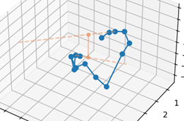
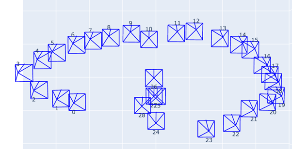

# Algorithm Description
The algorithm to smoothen the camera pose trajectory is split to 2 parts:
1.	Finding the optimal (initial_camera_pose, last_camera_pose) pair – or, in other words, determine which frames should be cut out ("excluded").
2.	Generating new frames to connect the new last_camera_pose and the new initial_camera_pose in a smooth pattern.
## Algorithm part 1
To decide how to perform part 1 of the algorithm – which is, to determine which new initial_camera_pose and last_camera_pose pair to use (which means, the frames in between will be excluded), I initially made a reduction to the 2D plane.
I looked at the first pair of poses (`pos[1]` and `pos[0]`), and last pair of poses (`pos[-2]` and `pos[-1]`) and draw a ray from each pair of consecutive points 
* The "first_ray", which is the ray which initiates at `pos[1]` and passes through `pos[0]`.
We say that the first_ray is defined by the first pose (`pos[0]`).
* The "last_ray", which is the ray which initiates at `pos[-2]` and passes through `pos[-1]`.
We say that the last_ray is defined by the last pose (`pos[-1]`).
The algorithm then proceeds as follows:
* If first_ray and last_ray doesn't intersect, then the (pos[0], pos[-1]) pair isn't good enough as the edge points of the trajectory.
  * Note that, we are talking about a ray and not a line for a reason – the intersection must be in the right direction (which is between the first and last poses).

Therefore, a new `first_pose` and `last_pose` pair should be found iteratively.
There is O(n^2) such pairs.
* If there is, then save pair of new poses including the number of frames excluded for later consideration and continue.
Then, the algorithm picks the pair of poses which excludes the minimum number of frames.
If there are valid pairs that exclude minimal number of frames, then the algorithm prioritizes frames that are excluded from the end of the trajectory over the start. 
* Another consideration that can be made to decide which are the optimal pair among those who provided minimal exclusion is by picking the pair where the distance between the last pose and the start pose is the shortest.
The transition to the 3D poses is made by looking at the rays' distance instead of intersection.
* The distance between 2 lines is perpendicular to both lines.
We find the closest points on first_ray and last_ray respectively, and consider it as valid only if both points are in the correct direction on the rays relative to the previous point.

To test the algorithm on different camera position trajectories, I've implemented 2 simulators:

__simulator 1__: A camera pose synthesizer simulator which allows you to manually draw a trajectory of camera poses.
For the convenience of usage, the camera poses were drawn in the 2d plane, and later the Z-axis values were assigned to the points.

__simulator 2__: Visually displays the rays computed by the algorithm's stage 1 functionality, of all valid initial and last camera pose pairs, in 3D space. 

### Example 1 – testing the algorithm on an easy trajectory
I generated a relatively simple scenario of camera poses to initially test the algorithm behavior:

Then ran the second simulator on the above synthesized camera poses (with randomly added Z-axis values):
#### The results:

 
First solution – 0 frame exclusions (perfect): 

Let's take another perspective which shows the Z-axis values as well:

 

__Solution 2 – 1 frame is excluded from the start of the trajectory:__

  
__Solution 3 – 2 frame are excluded (both from the start)__

 
__Solution 4 – 3 frame are excluded (all from the start)__

 
__Solution 5 – 4 frame are excluded (all from the start)__

 

### Example 2 – Testing the algorithm on a harder trajectory
This time I generated a camera pose trajectory that is more spiral-like, to see how it handles exclusion of overlapping areas:

 
In this scenario, the algorithm found (again) 5 suitable (first, last) frame matches, but now some frames must be cut out:

 
__First solution found – 5 frames are excluded (all cut out from the end of the trajectory):__

 
I rendered it in multiple angles, to see how it took the Z-axis values into consideration:

 
The algorithm choice seems valid and works very well.
__Second solution – 3 frames were cut out, 1 from the start and 2 from the end of the trajectory:__

  
__Solution 3 – 3 frames were cut out, 2 from the start and 1 from the end of the trajectory:__

__Solution 4 – 3 frames were cut out, all 3 are from the start of the trajectory:__

 
__And, solution 5 – 4 frames were cut out, all 4 frames are from the start of the trajectory:__

 
## Algorithm part 2
The algorithm part 2 part is to generate, after the new `initial_pose` and `last_pose` of the trajectory were chosen, new camera poses to smoothly connect between the first and the last poses.

This is the easier part, as there are existing solutions which we can apply to our scenario. 

I chose to use cubic spline for the smooth frame xyz location synthesis, and SLERP (spherical linear interpolation) for applying smooth rotation transitions of to the generated frames by performing interpolation of the quaternion values between the last camera pose to the first camera pose.

The full algorithm works as follows:
* Take 3 frames from the beginning of the trajectory, and 3 frames from the end
* Draw a cubic spline that passes through those 6 frames
* Calculate the curve distance of the first 3 frames and last 3 frames on the spline
* Take the average of the spline-distances between consecutive frames, and use it as the distance between the frames to generate
    * This will also determine how many frames to generate.

Frame generation:
* Begin from the end frame, and generate new xyz positions by iteratively walking the spline by steps of average_spline_distance.
* To the rotation, perform spherical linear interpolation from the first frame to the last frame using the SLERP algorithm.

### results:
__Original trajectory:__

 
__The full spline trajectory that passes through the last 3 poses and the first 3 poses:__

 
__Keeping only the camera poses between the last and the first poses:__

 
__Another example:__

# Running Altogether
## Nerf
I ran instant-ngp model from https://github.com/NVlabs/instant-ngp, on a computer with Quadro RTX 4000 GPU. 

This was very convenient and recommended (after very long time I tried to run it locally with CPU or using colab, with insufficient results).

Then I used `instant-ngp/scripts/run.py` to write a script which takes the instant-ngp model snapshot and c2w poses from the `generate_poses.npy` file, and download the rendered images at that poses. 

## Results
### Example 1 – filming my worker tag in a (pretty bad) front elliptical trajectory

After applying the algorithm:

* The 4 last frames were excluded (grayed out in the drawing)
* 2 new frames were generated (drawn in pink) to enclose the trajectory

#### Comparison of the gifs before and after applying the smoothing

### Example 2 – filming my army shoes in a surround trajectory
Complete camera trajectory:
* As seen, 3 Frames were added by the algorithm:

Viewing the trajectory from above:

#### Comparison of the gifs before and after applying the smoothing

